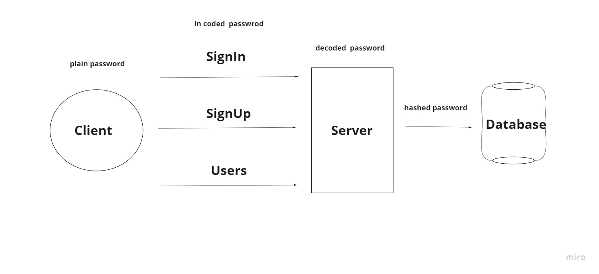

# Authentication server

### Author
Abdallah Zakaria

### Authentication System Overview
An Express/Node.js based server using a custom “authentication” module that is designed to handle user registration and sign in using Basic, Bearer, or OAuth along with a custom “authorization” module that will grant/deny users access to the server based on their role or permissions level.
### Setup 
  - On the terminal clone `git clone https://github.com/Abdallah-Zakaria/Authentication.git`
  - `npm init -y`
  - `npm i express dotenv mongoose jsonwebtoken bcrypt base-64`

### Test
- manual test
  POST to /signup to create a new user
  POST to /signin to login as a user 
- jest test
  - `npm i -D jest supergoose`
  - `npm test auth.test.js`

### UML 
